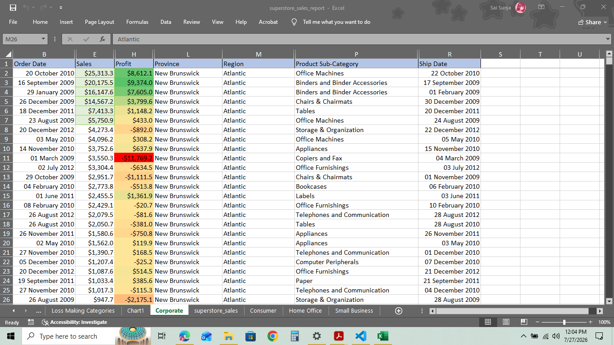
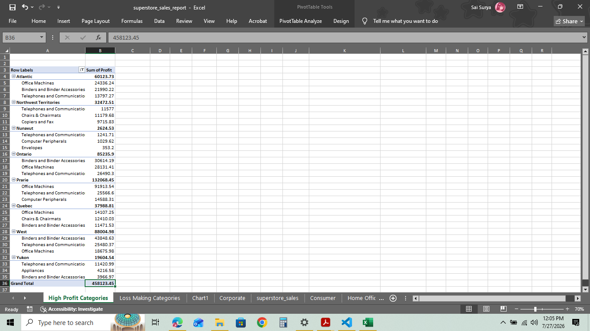
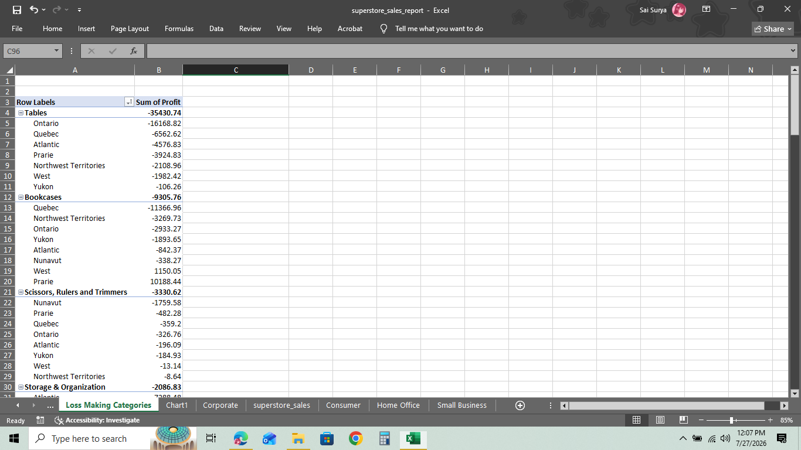

# Superstore Sales — Profitability Analysis (Excel)

An Excel-based analysis of a Canadian retail chain's sales data, built to answer one question a sales manager actually cares about: **which product subcategories are making money, and which should be discontinued?**

The analysis is scoped to the **Corporate customer segment**, and combines data cleaning, formatting, multi-level sorting, conditional formatting, and PivotTables to surface actionable insights.

---

## Business Problem

Superstore Sales operates across Canadian regions and sells everything from binders to bookcases. Not every product line is profitable in every region — some are quietly bleeding money while others drive most of the margin. This project identifies:

- The most profitable product subcategories, region by region
- The most loss-making subcategories, and where they lose the most
- Whether any subcategories show inconsistent behavior (profitable in some regions, a loss in others) worth investigating before a blanket "discontinue" decision

---

## Dataset

- **Source file:** [`data/superstore_sales.csv`](data/superstore_sales.csv)
- **Size:** ~8,400 orders across 4 customer segments (Consumer, Corporate, Home Office, Small Business), 8 regions, and 17 product subcategories
- **Key fields:** Order Date, Sales, Profit, Discount, Region, Province, Customer Segment, Product Category/Sub-Category, Product Base Margin

---

## What I Did

**1. Data Segmentation**
- Split the raw dataset into 4 worksheets, one per customer segment
- Focused all downstream analysis on the **Corporate** segment (3,076 orders)

**2. Formatting & Readability**
- Auto-sized columns, styled and bordered the header row, froze the header row for scrolling
- Removed/hid columns not relevant to the profitability story
- Reformatted Sales and Profit as currency (USD, 1 decimal place) and Order/Ship Date into a readable date format

**3. Sorting**
- Sorted alphabetically by Region → then Province → then by Sales (descending) within each Province, so the highest-value orders surface first within each geography

**4. Conditional Formatting**
- Highlighted the **top 10% of orders by sales** within each Region/Province in green (fill + border)
- Applied a **red–green profit gradient** across all rows — deeper green for higher profit, deeper red for bigger losses — so loss-making orders are visible at a glance without reading every number

**5. PivotTable Analysis**
- **Top 3 most profitable subcategories per region** (separate worksheet)
- **Most loss-making subcategories overall**, broken down by the regions where they lose the most (separate worksheet)

---

## Key Findings

- **Tables** is the single biggest loss-maker in the Corporate segment, losing **-$35,430.74** overall — and the losses aren't isolated to one region. Ontario alone accounts for **-$16,168.82** of that, with Quebec, Atlantic, and Prairie all in the red on Tables too.
- **Bookcases** is the second-largest loss-maker (**-$9,305.76** overall) but tells a more nuanced story: it's actually *profitable* in Prairie (+$10,188.44) and West, while deeply unprofitable in Quebec (-$11,366.96). This is a case for regional strategy, not a blanket discontinuation.
- **Office Machines**, **Binders and Binder Accessories**, and **Telephones and Communication** are consistently the top 3 profit drivers across almost every region — these are the categories to protect and double down on.
- **Hypothesis worth testing:** Tables and Chairs are commonly bought together. Tables' heavy losses may reflect discount-driven bundling to move furniture sets rather than the product itself being unprofitable — worth checking discount rates on Table orders before recommending discontinuation outright.

---

## Deliverable

📁 [`deliverable/superstore_sales_report.xlsx`](deliverable/superstore_sales_report.xlsx)

Contains:
- 4 segment worksheets (raw data)
- 1 formatted, sorted, conditionally-formatted Corporate report
- 2 PivotTable worksheets (top-3 profitable by region; loss-making subcategories by region)

---

## Screenshots

**Corporate sheet — formatting, sorting & profit gradient**
Currency-formatted Sales/Profit, readable dates, and the red–green conditional formatting gradient (darker red = bigger loss, darker green = higher profit).



**PivotTable — Profit by Region → Subcategory**
Total profit for each region, broken down by its top contributing product subcategories.



**PivotTable — Loss-Making Subcategories by Region**
Tables and Bookcases isolated as the two biggest loss-makers, with a regional breakdown showing exactly where each one bleeds money (and, in Bookcases' case, where it's actually profitable).



---

## Tools & Skills

`Microsoft Excel` — PivotTables, conditional formatting, multi-level sorting, custom number/date formatting, freeze panes, data segmentation

---

## Files in This Repo

```
├── data/
│   └── superstore_sales.csv              # Raw dataset
├── deliverable/
│   └── superstore_sales_report.xlsx      # Final formatted report + pivot tables
├── screenshots/                          # Visual walkthrough of the analysis
└── README.md
```
